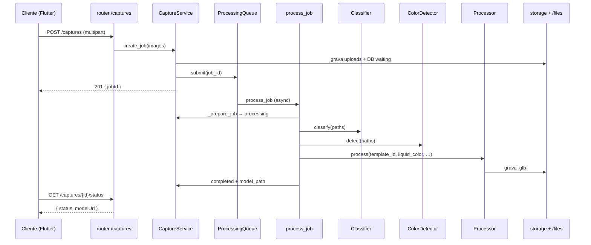

# 05 — Arquitetura

Este documento descreve a **arquitetura lógica** do backend: camadas, padrões de projeto e fluxo de dados. A fonte canônica continua sendo o código em `app/`.

## Visão em camadas

```
┌─────────────────────────────────────────────────────────────┐
│  HTTP (FastAPI)                                              │
│  routers: captures, health  →  dependências, exceções      │
└───────────────────────────┬─────────────────────────────────┘
                            │
┌───────────────────────────▼─────────────────────────────────┐
│  Aplicação (use cases)                                       │
│  CaptureService: orquestra job, classificador, cor, fila,    │
│                  processor                                   │
└───────────────────────────┬─────────────────────────────────┘
         │                  │                  │
         ▼                  ▼                  ▼
┌──────────────┐  ┌─────────────────┐  ┌──────────────────┐
│ Infraestrutura│  │  Estratégias    │  │  Persistência   │
│ LocalStorage  │  │  Processor,     │  │  CaptureRepository│
│ (disco)       │  │  Classifier,    │  │  + SQLAlchemy   │
│               │  │  ColorDetector  │  │  async (Postgres)│
└──────────────┘  └─────────────────┘  └──────────────────┘
         │
         ▼
┌──────────────────┐
│ Processo externo │
│ Blender (bpy)    │  invocado via subprocess, não importa o app
└──────────────────┘
```

## Padrão Strategy (pipeline 3D)

O backend isola trocas de implementação com **ABC** + fábricas em `main.py`:

| Abstração | Implementações | Configuração (`.env`) |
|-----------|----------------|----------------------|
| `Processor` | `FakeProcessor`, `TemplateProcessor` | `PROCESSOR_TYPE` = `fake` \| `template` |
| `Classifier` | `DisabledClassifier`, `CLIPClassifier` | `CLASSIFIER_TYPE` = `disabled` \| `clip` |
| `ColorDetector` | `DisabledColorDetector`, `AverageColorDetector` | `COLOR_DETECTOR_TYPE` = `disabled` \| `average` |

- O **resto do código** (principalmente `CaptureService`) depende só das ABCs, não conhece CLIP nem Blender.
- Trocar o pipeline 3D no futuro (ex.: Hunyuan3D) = nova classe `Processor` + uma linha na factory `build_processor()`.

## Injeção de dependência

- **FastAPI**: `get_capture_service(request)` lê `request.app.state.capture_service` (ver [`dependencies.py`](../app/dependencies.py)). O `CaptureService` é montado no `production_lifespan` com as factories acima.
- **Testes**: `create_app(storage_dir=tmp, lifespan=None)` permite injetar serviço mock ou DB SQLite sem estado global compartilhado.

## Fluxo de um job (sequência)



## Concorrência e fila

- `ProcessingQueue` é uma `asyncio.Queue` com **um worker** in-process (task `asyncio.create_task`), consumindo `job_id` e chamando `CaptureService.process_job`.
- Não há fila distribuída (Redis/Celery); adequado a MVP e TCC. Escalar = trocar `ProcessingQueue` por outra implementação com a mesma interface (`submit` / `start` / `stop`).

## Tratamento de erros

- Erros de domínio: `AppError` e subclasses (`ValidationError` 422, `NotFoundError` 404) → JSON `{"error": "..."}`.
- Falhas do **classificador** ou **detector de cor** durante `process_job`: logadas, job **não** falha; usam default (`rectangular_basic` e cor padrão do material).
- Falha do **Processor** (Blender com exit ≠ 0, GLB ausente): job vai para `error` com mensagem.

## Onde achar cada conceito

| Conceito | Arquivos |
|----------|----------|
| Fábricas e lifespan | `app/main.py` |
| Orquestração do job | `app/modules/captures/service.py` |
| Submissão e worker | `app/modules/captures/queue.py` |
| HTTP captures | `app/modules/captures/router.py` |
| DTOs e aliases camelCase | `app/modules/captures/schemas.py` |
| Regras 3D (GLB) | `app/modules/captures/processor.py` |
| Script Blender | `app/modules/captures/blender_scripts/customize_template.py` |

## Leituras relacionadas

- [06 — Bootstrap e lifespan](06-bootstrap-e-lifespan.md)
- [09 — Pipeline 3D](09-pipeline-3d.md)
- [10 — Classificador e cor](10-classificador-e-cor.md)
