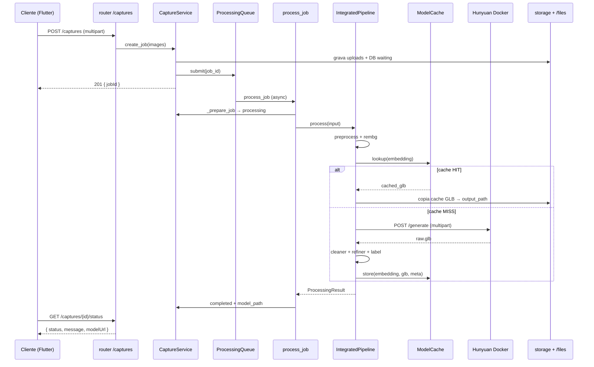

# 05 — Arquitetura

> **O que você vai aprender neste doc**
> - As camadas do backend (`router → service → pipeline → storage/DB`) e por que separá-las.
> - O **padrão Strategy** aplicado ao pipeline 3D — a ideia central do projeto.
> - Como a injeção de dependência é feita "na mão" no `main.py`, sem framework de DI.
> - O ciclo de vida de um job, passo a passo (diagrama de sequência).
>
> **Pré-requisitos:** [01 - Visão geral](01-visao-geral.md) e [04 - Estrutura de pastas](04-estrutura-de-pastas.md).

Este documento descreve a **arquitetura lógica** do backend: camadas, padrões de projeto e fluxo de dados. A fonte canônica continua sendo o código em `app/`.

> **Padrão Strategy em uma frase:** definir uma família de algoritmos intercambiáveis
> atrás de uma mesma interface, e escolher qual usar em tempo de configuração. Aqui,
> cada etapa do pipeline (remover fundo, refinar malha, etc.) é uma "estratégia"
> ligada/desligada pelo `.env` — o resto do código não sabe qual implementação está rodando.

## Visão em camadas

```
┌─────────────────────────────────────────────────────────────┐
│  HTTP (FastAPI)                                              │
│  routers: captures, health, sales  →  deps, exceções        │
└───────────────────────────┬─────────────────────────────────┘
                            │
┌───────────────────────────▼─────────────────────────────────┐
│  Aplicação (use cases)                                       │
│  CaptureService: cria job, persiste, enfileira,             │
│                  delega para Pipeline                        │
└───────────────────────────┬─────────────────────────────────┘
                            │
┌───────────────────────────▼─────────────────────────────────┐
│  Pipeline 3D (composição de Strategies)                      │
│  IntegratedPipeline = preprocess → rembg → cache.lookup →    │
│                       hunyuan → cleaner → refiner → label →  │
│                       cache.store                            │
└─────┬────────────┬──────────────────┬──────────────┬─────────┘
      │            │                  │              │
      ▼            ▼                  ▼              ▼
┌──────────┐ ┌──────────────┐ ┌─────────────┐ ┌─────────────┐
│ Storage  │ │ Estratégias  │ │ ModelCache  │ │ Persistência│
│ Local    │ │ por stage    │ │ (CLIP)      │ │ Postgres    │
│ (disco)  │ │              │ │             │ │ (SQLAlchemy)│
└──────────┘ └──────┬───────┘ └──────┬──────┘ └─────────────┘
                    │                │
                    ▼                ▼
            ┌────────────────┐  ┌──────────────────┐
            │ Hunyuan Docker │  │ Blender headless │
            │ (HTTP/GPU)     │  │ (subprocess)     │
            └────────────────┘  └──────────────────┘
```

## Padrão Strategy (pipeline 3D)

O backend isola trocas de implementação com **ABC** + fábricas em `main.py`:

| Abstração | Implementações | Configuração (`.env`) |
|-----------|----------------|----------------------|
| `Processor` (raiz) | `FakeProcessor`, `TemplateProcessor`, `IntegratedPipeline` | `PIPELINE_MODE` = `fake` \| `template` \| `integrated` |
| `ImagePreprocessor` | `DisabledImagePreprocessor`, `StandardImagePreprocessor` | `IMAGE_PREPROCESSOR_TYPE` = `disabled` \| `standard` |
| `BackgroundRemover` | `DisabledBackgroundRemover`, `RembgBackgroundRemover` | `BACKGROUND_REMOVER_TYPE` = `disabled` \| `rembg` |
| `MeshCleaner` | `DisabledMeshCleaner`, `BlenderMeshCleaner` | `MESH_CLEANER_TYPE` = `disabled` \| `blender` |
| `MeshRefiner` | `DisabledMeshRefiner`, `BlenderMeshRefiner` | `MESH_REFINER_TYPE` = `disabled` \| `blender` |
| `LabelExtractor` | `DisabledLabelExtractor`, `HomographyLabelExtractor` | `LABEL_EXTRACTOR_TYPE` = `disabled` \| `homography` |
| `LabelUpscaler` | `DisabledLabelUpscaler`, `LanczosLabelUpscaler` | `LABEL_UPSCALER_TYPE` = `disabled` \| `lanczos` |
| `LabelProjector` | `DisabledLabelProjector`, `BlenderLabelProjector` | `LABEL_PROJECTOR_TYPE` = `disabled` \| `blender` |
| `ImageEmbedder` | `DisabledEmbedder`, `ClipImageEmbedder` | `CACHE_EMBEDDER_TYPE` = `disabled` \| `clip` |
| `ModelCache` | `DisabledModelCache`, `ClipSimilarityCache` | `CACHE_ENABLED` = `true` \| `false` |

O **resto do código** (principalmente `CaptureService`) depende só das ABCs e do `Processor` raiz; não conhece CLIP, rembg nem Blender direto. O `IntegratedPipeline` orquestra os stages internamente e expõe a mesma interface `Processor.process(input)`.

## Injeção de dependência

- **FastAPI**: `get_capture_service(request)` lê `request.app.state.capture_service` (ver [`dependencies.py`](../app/dependencies.py)). O `CaptureService` é montado no `production_lifespan` com as factories.
- **Testes**: `create_app(storage_dir=tmp, lifespan=None)` permite injetar serviço mock ou DB SQLite sem estado global compartilhado.

## Fluxo de um job (sequência)



## Concorrência e fila

- `ProcessingQueue` é uma `asyncio.Queue` com **um worker** in-process (task `asyncio.create_task`), consumindo `job_id` e chamando `CaptureService.process_job`.
- Não há fila distribuída (Redis/Celery); adequado a MVP e TCC. Escalar = trocar `ProcessingQueue` por outra implementação com a mesma interface (`submit` / `start` / `stop`).
- O Hunyuan roda **em outro processo** (contêiner Docker) e é chamado via `httpx.AsyncClient`. O backend não importa `torch` nem nenhuma lib de ML pesada.

## Tratamento de erros

- Erros de domínio: `AppError` e subclasses (`ValidationError` 422, `NotFoundError` 404) → JSON `{"error": "..."}`.
- Falhas **dentro de stages opcionais** do pipeline (preprocess, rembg, label extraction) são logadas, o stage cai para bypass e o job continua. Documentado em [09f](09f-pipeline-integrado.md).
- Falha do **Hunyuan** (container offline, timeout, GLB inválido): se há `TemplateProcessor` configurado como fallback, o backend tenta gerar um template paramétrico; senão, o job vai para `error` com mensagem.
- Falha do **refiner** ou **projeção de label**: pipeline degrada — devolve o último GLB válido (`refined.glb` ou `cleaned.glb`).

## Onde achar cada conceito

| Conceito | Arquivos |
|----------|----------|
| Fábricas e lifespan | `app/main.py` |
| Orquestração do job | `app/modules/captures/service.py` |
| Composição do pipeline | `app/modules/captures/pipeline.py` |
| Cache de modelos (CLIP) | `app/modules/captures/cache.py`, `app/modules/captures/embeddings.py` |
| Tabela persistente do cache | `app/modules/captures/modelos_universais.py` |
| Submissão e worker | `app/modules/captures/queue.py` |
| HTTP captures | `app/modules/captures/router.py` |
| DTOs e aliases camelCase | `app/modules/captures/schemas.py` |
| Cliente HTTP do Hunyuan | `app/modules/captures/processor.py` (`Hunyuan3DProcessor`) |
| Scripts Blender | `app/modules/captures/blender_scripts/` |

## Leituras relacionadas

- [06 — Bootstrap e lifespan](06-bootstrap-e-lifespan.md)
- [09f — Pipeline integrado](09f-pipeline-integrado.md)
- [09g — Cache de similaridade CLIP](09g-cache-similaridade-clip.md)
- [10 — Embedder CLIP e detector de cor](10-classificador-e-cor.md)
