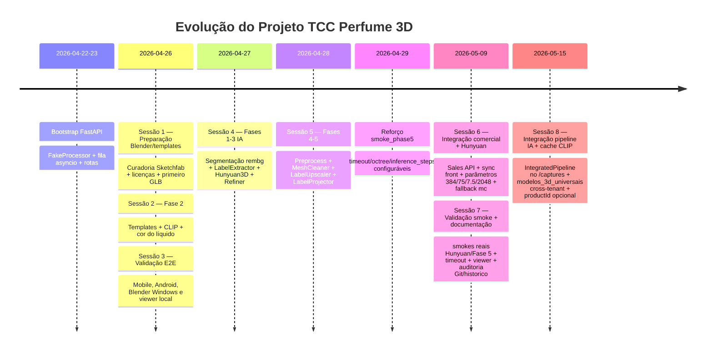

# Histórico de Sessões — Projeto TCC Perfume 3D

Índice cronológico das sessões documentadas. Cada linha aponta para um arquivo em `historico/` no padrão `YYYY-MM-DD_titulo-curto-da-sessao.md`. A data usada no nome é, por convenção, a **data inferida pelos commits Git** que a sessão endereça, não necessariamente a data de redação do documento.

Observação estrutural: `C:\TCC` não é um repositório Git único. O histórico acadêmico está em `back/historico/`, mas algumas sessões registram commits do repositório `front` quando a evolução envolveu o app Flutter.

## Tabela Cronológica

| # | Arquivo | Data inferida (commits) | Commits associados (resumo) | Resumo de 1 linha |
|---|---|---|---|---|
| 0 | *(sem documento)* | 2026-04-22 → 2026-04-23 | `back`: `b724648`, `6de1423`, `8e6a08e`, `19048d3`, `726fb62`, `0106a1f` | Bootstrap do backend FastAPI: `Processor` ABC, `FakeProcessor`, fila asyncio, rotas `POST /captures` e `GET /captures/{id}/status`, `main.py` com lifespan + CORS + StaticFiles, README e smoke E2E. |
| 1 | [`2026-04-26_preparacao-blender-templates.md`](2026-04-26_preparacao-blender-templates.md) | 2026-04-26 | `back`: `04c44c2` *(sobrepõe a abertura da Fase 2)*; relacionados: `408ef0f`, `f8b3c39` | **Preparação da Fase 2** — pivot Meshroom → Blender/templates, curadoria Sketchfab, política de licenças, catálogo, atribuições, `.gitignore` para raw assets e primeiro `rectangular_basic.glb`. |
| 2 | [`2026-04-26_fase2-templates-clip-cor.md`](2026-04-26_fase2-templates-clip-cor.md) | 2026-04-26 | `back`: `04c44c2`, `1fa0a2e`, `f073dbb`, `fd70010`, `57766a1`, `1a46a0e`, `1d4ec12`, `30e1d8d`, `338d935`, `5a7663d`, `26799cf`, `f8b3c39`, `408ef0f` | **Fase 2** — templates paramétricos normalizados, `CLIPClassifier`, `AverageColorDetector`, integração no `CaptureService`, viewer HTML e diagnóstico inicial com perfumes reais. |
| 3 | [`2026-04-26_validacao-e2e-mobile-viewer-local.md`](2026-04-26_validacao-e2e-mobile-viewer-local.md) | 2026-04-26 | `back`: `f073dbb`, `1a46a0e`, `1d4ec12`, `30e1d8d`, `338d935`, `5a7663d`; `front`: `91eaaaa`, `f0537cb` | **Validação E2E mobile/notebook** — corrige IP local, retry, WebView cleartext, picker da galeria, subprocess Blender no Windows e cria viewer local para inspecionar GLBs fora do celular. |
| 4 | [`2026-05-09_pipeline-ia-segmentacao-e-refinamento.md`](2026-05-09_pipeline-ia-segmentacao-e-refinamento.md) | 2026-04-27 *(divergência consciente: nome de arquivo é 2026-05-09)* | `back`: `71a813c`, `7a9408e`, `7990224`, `a1b37ad` | **Fases 1–3 do pipeline IA** — `RembgBackgroundRemover`, `HomographyLabelExtractor`, `Hunyuan3DProcessor` via Docker e `BlenderMeshRefiner` com shader de vidro PBR. |
| 5 | [`2026-04-28_fase4-fase5-preprocessamento-cleanup-label.md`](2026-04-28_fase4-fase5-preprocessamento-cleanup-label.md) | 2026-04-28 → 2026-04-29 | `back`: `6e6f212`, `df843ca` | **Fases 4 e 5** — `StandardImagePreprocessor`, `BlenderMeshCleaner`, `LanczosLabelUpscaler`, `BlenderLabelProjector` e smokes ponta a ponta para limpeza/refinamento/label. |
| 6 | [`2026-05-09_integracao-sales-e-melhorias-hunyuan.md`](2026-05-09_integracao-sales-e-melhorias-hunyuan.md) | 2026-05-09 | `back`: `724915c`; relacionado: `df843ca`; `front`: mudanças locais não commitadas | **Integração comercial + ajustes Hunyuan** — módulo `sales`, endpoints de snapshot/produto/estoque/venda, sincronização inicial do front, parâmetros Hunyuan 384/75/7.5/2048 e fallback para `mc` após falha do `dmc`. |
| 7 | [`2026-05-09_validacao-smoke-hunyuan-e-documentacao-cronologica.md`](2026-05-09_validacao-smoke-hunyuan-e-documentacao-cronologica.md) | 2026-05-09 | `back`: `724915c`; relacionados: `df843ca`, `6e6f212`; `historico/`: sem commit próprio no momento | **Validação operacional + documentação cronológica** — registra smokes reais Hunyuan/Fase 5, links do viewer, timeout de `/generate`, distinção entre `--no-label` e textura Hunyuan, bypass conservador do cleanup e auditoria Git do histórico. |
| 8 | [`2026-05-15_integracao-pipeline-ia-e-cache-clip.md`](2026-05-15_integracao-pipeline-ia-e-cache-clip.md) | 2026-05-15 | `back`: `a2170b0` (docs) + 3 commits Fase 1/2/3 (código) | **Integração do pipeline IA ao `/captures` + cache CLIP cross-tenant** — Hunyuan vira default; `IntegratedPipeline` orquestra 8 stages dentro do worker; nova tabela `modelos_3d_universais` separada da `modelos_3d_produto` por-tenant; `productId` opcional no `POST /captures`; service refatorado magro; `PROCESSOR_TYPE` → `PIPELINE_MODE` com alias legacy; 205 testes passando. |

## Linha Do Tempo



## Convenções

1. **Data por commits, não por redação.** Se um documento for redigido com defasagem em relação ao trabalho que descreve, o nome do arquivo refere-se aos commits. Divergências entre data do arquivo e data dos commits ficam explícitas em §1 do próprio documento.
2. **Hash curto como referência canônica.** Sete caracteres são suficientes neste repositório; usar `git show <hash>` para auditoria.
3. **Repositórios separados.** Quando uma sessão cita `front`, os hashes pertencem ao repositório Flutter e não aparecem no `git log` do backend.
4. **Sessões paralelas.** Quando dois conjuntos de commits da mesma data tocam subsistemas independentes, eles são registrados como linhas separadas no índice e não forçam dependência causal.
5. **Trabalho não-documentado.** Períodos sem histórico ficam visíveis no índice. Isso é intencional: o gap também faz parte da realidade metodológica do projeto.
6. **Itens marcados `[verificar]`.** Indicam pontos onde o estado do repositório no momento da redação não foi diretamente inspecionado e merece confirmação manual antes de citação no texto final do TCC.

## Auditoria

Para reconstruir o estado de qualquer ponto:

```bash
git log --all --pretty=format:"%h %ad %s" --date=short
git show <hash>           # diff completo + mensagem
git show --stat <hash>    # apenas estatísticas
git log --follow <arquivo>
git diff <hash1>..<hash2> # entre dois pontos
```
